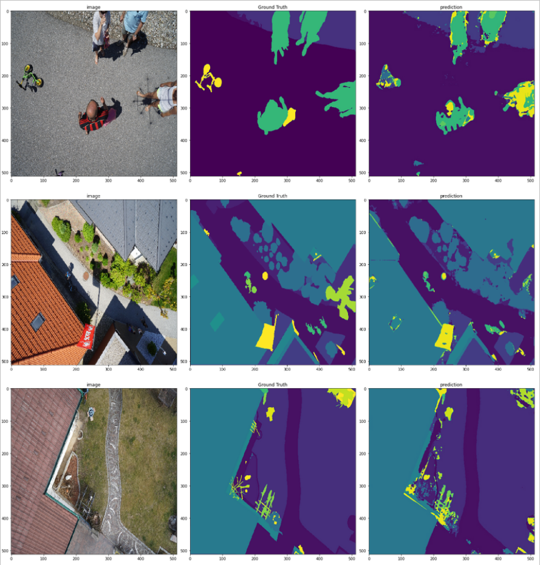

# Image segmentation U-Net

Folder u_net_architectures contains implementations of:

<li> Attention U-net
<li> U-net++
<li> Residual U-net
<li> Dense U-net
<li> Base U-net

Segmentation was performed on: https://www.tugraz.at/index.php?id=22387

notebook model_training contains code for data augmentation and model training 

predictions made by most succesful model - Attention Unet:

